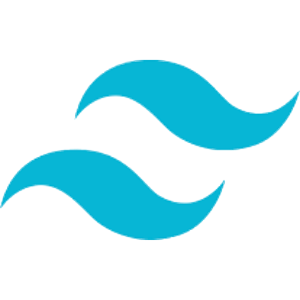
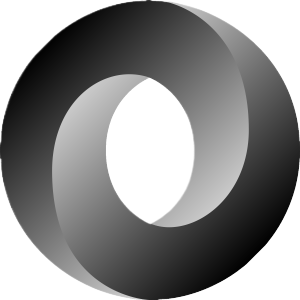

 

# About Us:

<h3>2008 – 2015: Instrucontrols Era</h3>
The journey began in 2008 as Instrucontrols, specializing in project support, commissioning management, and supervision within the electrotechnical and instrumentation discipline. During this phase, the company successfully supported multiple projects for prominent engineering, construction and operating companies like Siemens, Croon, Cegelec, Stork, Gasunie, Shell, Amoco, Statoil, NUON, GDF Suez, Air Liquide, BASF, BP, Pharmacia & Upjohn, ADM, Fluor, Jacobs and CB&I.
<h3>2015 – 2019: Easypower Europ Ventures</h3>
In 2015, Instrucontrols transformed into Easypower Europ, focusing on sales, project support, and software development support for EasyPower® electrotechnical engineering software. The company played a pivotal role in modifying the EasyPower® software for the European market. Subsequently, the EasyPower® software achieved successful sales, being acquired by Bentley Systems®. During this period, Easypower Europ also supported the development of the AGM Advanced Generator Monitoring system. The apparatus was successfully completed and commissioned and the AGM continues to be utilized for testing generators.
<h3>2019 – 2023: PQX Global and Adaptation</h3>
Pivoting in 2019, the company transformed into PQX Global, aiming to establish an e-commerce platform for the sales of electrical personal protective equipment (PPE). Unfortunately, intense competition led to the difficult decision to halt this venture. During the challenging period of the COVID-19 pandemic, the company adapted by embracing web development.
<h3>2023 – Present: Web Apps for Industry Emerges</h3>
In 2023, Web Apps for Industry emerged, focusing on the development of technical web applications for industrial projects. The company&apos;s ethos revolves around embracing challenges and providing innovative solutions to complex problems. Web Apps for Industry has a passion for pushing boundaries, consistently delivering results that surpass expectations.   Positioned at the forefront of technological advancements, the company is dedicated to developing efficient applications for sectors such as Oil & Gas up and downstream, (Petro)-Chemicals, Steel, Mining, Power Generation, Food and Manufacturing in the disciplines Engineering, Construction, Commissioning, Operations and maintenance.   Making the world go round, one project at a time, we are committed to progress and excellence in the ever-evolving landscape of web development.   Web Apps for Industry does not only have expertise in web development but also in the disciplines mechanical, electrical, instrumentation, and controls, further enriching its multifaceted capabilities.

## Some examples of past projects:
 
-	Software Development of an application for cable pulling at a Drilling rig for <a href="https://www.dolphindrilling.com/our-fleet/blackford-dolphin">DOLPHIN DRILLING</a > at <a href="https://www.damen.com/companies/shiprepair/damen-verolme-rotterdam">DAMEN VEROLME</a> in <a href="https://www.google.com/maps/place/Damen+Verolme+Rotterdam+BV/@51.8915102,4.2939173,15z/data=!4m6!3m5!1s0x47c44b994def4b23:0x897748105a0d1b15!8m2!3d51.8915102!4d4.2939173!16s%2Fg%2F1yy3vlscr?entry=ttu">Rotterdam, The Netherlands</a>.
-	Software Development of an application for commissioning of a <a href="https://en.wikipedia.org/wiki/HSL-Zuid">High speed railway</a> for <a href="https://www.mobility.siemens.com/global/en.html">SIEMENS</a> at <a href="https://en.wikipedia.org/wiki/Infraspeed">INFRASPEED</a> in <a href="https://www.google.com/maps/search/siemens+zoetermeer/@52.0463011,4.5091092,17z?authuser=0&entry=ttu">Zoetermeer, The Netherlands</a>.
-	Software Development of an application for commissioning of 2 <a href="https://www.youtube.com/watch?v=IVUcauJSbQY" title="Drilling Modules">Drilling Rigs</a> for <a href="https://www.bp.com/">BP</a> at <a href="https://www.mercon.com/">MERCON</a> in <a href="https://www.google.com/maps/place/Mercon+Montage/@51.8281914,4.9615524,15z/data=!4m6!3m5!1s0x47c685e11636c165:0x6a2a3105ca530c9b!8m2!3d51.8281914!4d4.9615524!16s%2Fg%2F1tgw93l_?entry=ttu">Gorinchem, the Netherlands</a>.
- Software Development of a webshop for electrical safety gear with <a href="https://www.lightspeedhq.com/" title="Lightspeed">LIGHTSPEED</a>.
-	Software Translations for the AGM <a href="https://www.youtube.com/watch?v=wu27rzasVNM" title="AGM">Advanced generator monitor</a> in Dutch and German for a US company.
-	Engineering of hardware for the AGM <a href="https://www.youtube.com/watch?v=wu27rzasVNM" title="AGM">Advanced generator monitor</a> for a US company.
- Engineering for electrical system study for a <a href="https://www.youtube.com/watch?v=NgORKTMjjvM" title="Food Processing">Food Processing Plant</a> at <a href="https://www.adm.com/">ADM</a> in <a href="https://www.google.com/maps/search/adm/@48.9016631,12.5943983,13z?authuser=0&entry=ttu">Straubing, Germany</a>.
-	Construction of a <a href="chemical-plant.md" title="Chemical Plant">Chemical Plant</a> for <a href="https://www.fluor.com/">FLUOR</a> at <a href="https://www.basf.com/global/en/who-we-are/organization/locations/europe/german-sites/ludwigshafen.html">BASF</a> in <a href="https://www.google.com/maps/place/BASF+SE/@49.5029294,8.3905944,13z/data=!4m10!1m2!2m1!1sbasf+ludwigshafen!3m6!1s0x4797cc59d1a2e5ef:0x1beb4c307d74fde4!8m2!3d49.495018!4d8.434131!15sChFiYXNmIGx1ZHdpZ3NoYWZlbiIDiAEBkgEVY2hlbWljYWxfbWFudWZhY3R1cmVy4AEA!16s%2Fg%2F1tcxnmk6?authuser=0&entry=ttu">Ludwigshafen, Germany</a>.
-	Construction of a <a href="https://www.youtube.com/watch?v=eY9Lo7Aqo4g" title="Laboratory">Laboratory</a> for <a href="https://www.siemens.com/global/en/products/buildings/services.html">SIEMENS</a> at <a href="https://www.energytransitioncampus.com/">SHELL</a> in <a href="https://www.google.com/maps/place/Shell+Global+Solutions+International+B.V./@52.3905857,4.8987101,17z/data=!3m1!4b1!4m6!3m5!1s0x47c6084ac0400001:0x8d10766ba7a2a900!8m2!3d52.3905825!4d4.901285!16s%2Fg%2F11hzrsr851?authuser=0&entry=ttu">Amsterdam, the Netherlands</a>.
-	Construction of a <a href="https://www.youtube.com/watch?v=r-J392UzpyI" title="Catalytic Reactor">Catalytic Reactor</a> for <a href="https://www.shell.com/business-customers/chemicals.html">SHELL</a> in <a href="https://www.google.com/maps/place/Shell+Moerdijk/@51.6819154,4.567279,17z/data=!3m1!4b1!4m6!3m5!1s0x47c4249f99a90d7b:0xaaeea105f402b35!8m2!3d51.6819121!4d4.5698539!16s%2Fg%2F1tflllwl?authuser=0&entry=ttu">Moerdijk, the Netherlands</a>.
-	Construction of a <a href="https://www.youtube.com/watch?v=wmFy6a8g6-Y" title="LNG Plant">LNG Plant</a> for <a href="https://www.equinor.com/energy/snohvit">STATOIL</a> (now Equinor) at <a href="https://www.heerema.com/heerema-fabrication-group">HEEREMA</a> (now Oceanco) in <a href="https://www.google.com/maps/place/Oceanco/@51.807921,4.6181764,15.75z/data=!4m14!1m7!3m6!1s0x47c42f166ede6dcb:0x260c8c07a509caa!2sOceanco!8m2!3d51.8088071!4d4.6203796!16s%2Fg%2F11fly72lg0!3m5!1s0x47c42f166ede6dcb:0x260c8c07a509caa!8m2!3d51.8088071!4d4.6203796!16s%2Fg%2F11fly72lg0?authuser=0&entry=ttu">Zwijndrecht, the Netherlands</a>.
-	Construction of 5 <a href="power-plant.md" title="Power Plants">Power Plants</a> in the Netherlands.
 -	Construction of a <a href="https://www.youtube.com/watch?v=mtUVJRciSbA" title="Waste Incinerator">Waste Incinerator</a> for <a href="https://www.attero.nl/en/">ATTERO</a> in <a href="https://www.google.com/maps/place/Attero+Moerdijk+(AEC)/@51.68302,4.578459,18z/data=!4m10!1m2!2m1!1sattero+moerdijk!3m6!1s0x47c4249cb0a3e38b:0xfdf8239075b22f22!8m2!3d51.68302!4d4.5805189!15sCg9hdHRlcm8gbW9lcmRpamsiA4gBAZIBGHdhc3RlX21hbmFnZW1lbnRfc2VydmljZeABAA!16s%2Fg%2F1tdqgn18?authuser=0&entry=ttu">Moerdijk, the Netherlands</a>.
-	Commissioning of 2 <a href="https://www.youtube.com/watch?v=IVUcauJSbQY" title="Drilling Modules">Drilling Rigs</a> for <a href="https://www.bp.com/">BP</a> at <a href="https://www.mercon.com/">MERCON</a> in <a href="https://www.google.com/maps/place/Mercon+Montage/@51.8281947,4.9589775,673m/data=!3m2!1e3!4b1!4m6!3m5!1s0x47c685e11636c165:0x6a2a3105ca530c9b!8m2!3d51.8281914!4d4.9615524!16s%2Fg%2F1tgw93l_?authuser=0&entry=ttu">Gorinchem, the Netherlands</a>.
- Commissioning of a <a href="https://www.youtube.com/watch?v=mLjOg9j3WgU" title="Natural Gas Plant">Natural Gas Plant</a> for <a href="https://www.naturgy.com/en/">UNIÓN FENOSA</a> (now Naturgy) in <a href="https://www.google.com/maps/place/HEYCO,+PLANTA+DE+PRODUCCI%C3%93N+DE+GAS+%22VIURA%22/@42.4040049,-2.5937979,976m/data=!3m1!1e3!4m15!1m8!3m7!1s0xd5aab4130b390b1:0xf98252918a168870!2sLogro%C3%B1o,+La+Rioja,+Spain!3b1!8m2!3d42.4627195!4d-2.4449852!16zL20vMDFyc2o4!3m5!1s0xd455192239c1d0f:0x8469faa844a95b06!8m2!3d42.4047508!4d-2.5904264!16s%2Fg%2F11g1ftdy98?authuser=0&entry=ttu">Hornos de Moncalvillo, Spain</a>.

  
  
# Web Apps for Industry is ready to bring Progression, Quality and Expertise to your Next industrial web project by using the following tech stack:
 
&nbsp;

## Project Management:

## Architecture:

## Design:

## Development:

## Databases:

## MQTT:

## Security:

## Testing:

## Version Control & CI/CD:

## Hosting:

# Contact:
<h2>info@webappsforindustry.tech</h2>
 

